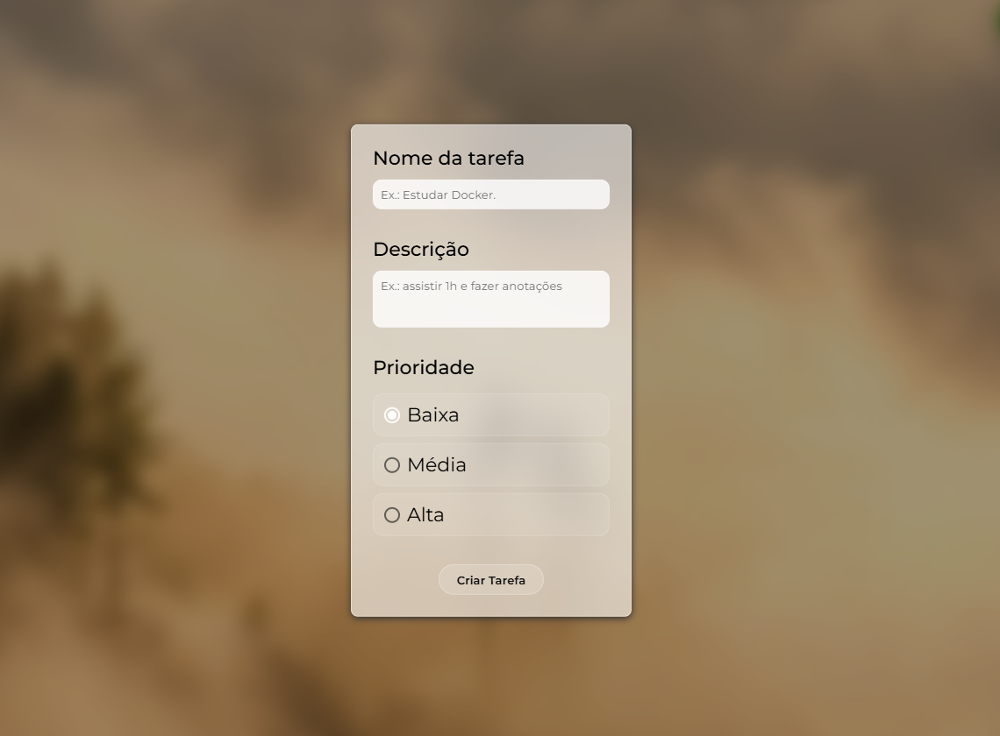
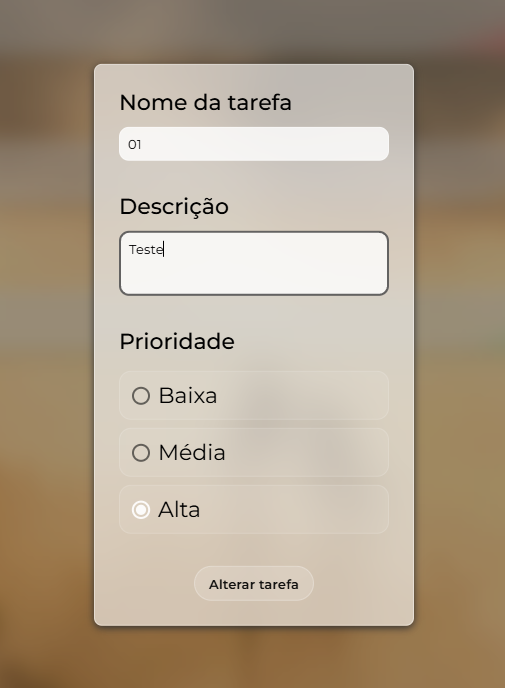
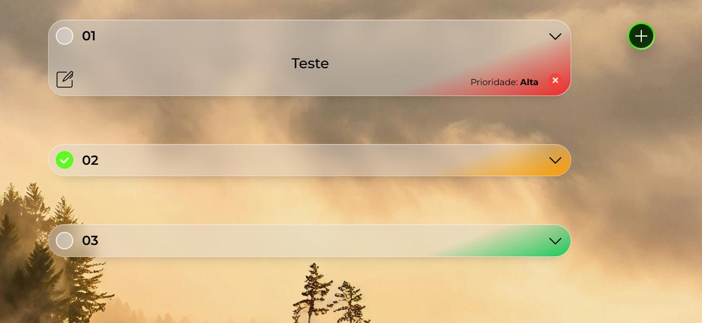

<h1 align="center">
  FlowList
</h1>

<p align="center">
  Aplicação Fullstack para gerenciamento de tarefas, integrando Angular no frontend e Java Spring Boot no backend.
</p>

---

## 📌 Visão Geral

O **FlowList** é uma aplicação Fullstack desenvolvida para demonstrar a integração real entre **frontend moderno com Angular** e **backend robusto em Java com Spring Boot**.

O sistema permite criar, listar, atualizar, finalizar e remover tarefas, seguindo boas práticas de desenvolvimento, arquitetura limpa e padrões REST.

Este projeto foi pensado tanto como **estudo prático** quanto como **portfólio profissional**, evidenciando a comunicação entre as camadas da aplicação.

---

## 🧩 Arquitetura Geral


- O **Angular** é responsável pela interface, experiência do usuário e consumo da API.
- O **Java(Spring Boot)** expõe uma API REST responsável por toda a regra de negócio.
- A comunicação ocorre via **HTTP com JSON**.

---

## 🛠️ Tecnologias Utilizadas

### 🔹 Frontend
- Angular
- TypeScript
- HTML5
- CSS3
- Consumo de API REST (HttpClient)

### 🔹 Backend
- Java 21
- Spring Boot
- Spring MVC
- Spring Data JPA
- SpringDoc OpenAPI 3 (Swagger)
- Maven

### 🔹 Banco de Dados
- PostgreSQL

---

## 📷 Preview

### Tela principal
  

### Criar tarefas
  

### Lista de tarefas
  

### Alterar tarefas
  

### Expansão de conteúdo
  


## 📐 Boas Práticas Adotadas

### Gerais
- Separação clara de responsabilidades
- Comunicação via API REST
- JSON como padrão de troca de dados

### Backend
- SOLID, DRY, YAGNI, KISS
- Injeção de Dependências
- Validação de dados
- Tratamento global de exceções
- Camadas bem definidas (Controller, Service, Repository)
- Testes unitários com JUnit e Mockito

### Frontend
- Componentização
- Organização por responsabilidade
- Mobile First
- Integração limpa com a API
- Separação entre lógica e apresentação

---

## ▶️ Como Executar o Projeto

### 📦 Backend (Spring Boot)

#### Pré-requisitos
- Java 17+
- Maven
- PostgreSQL

#### Passos
```bash
cd backend
./mvnw clean package
java -jar target/todolist-0.0.1-SNAPSHOT.jar
```
- Backend disponível em:
```bash
http://localhost:8080/todos
```

- Swagger
```bash
http://localhost:8080/swagger-ui.html
```

--- 

### 🎨 Frontend (Angular)

**Pré-requisitos** 
- Node.js
- Angular CLI

**Passos**
```bash
cd frontend
npm install
ng serve
```
Frontend disponível em:
```bash
http://localhost:4200
```
O frontend consome diretamente a API do backend via HTTP.

---

## 🔗 Integração Frontend + Backend

A integração ocorre através dos endpoints REST expostos pelo backend.

**Base URL**
```bash
http://localhost:8080/todos
```

**Principais operações:**

- Listar tarefas

- Criar tarefa

- Atualizar tarefa

- Marcar tarefa como concluída ou não

- Remover tarefa

O Angular utiliza serviços (services) para centralizar o consumo da API, garantindo organização e reaproveitamento de código.

---

## 📡 Endpoints Principais (Backend)

| Método | Rota                      | Descrição                   |
| ------ | ------------------------- | --------------------------- |
| GET    | `/todos`                  | Lista todas as tarefas      |
| POST   | `/todos/create`           | Cria uma nova tarefa        |
| PUT    | `/todos/{id}`             | Atualiza uma tarefa         |
| PATCH  | `/todos/{id}/{realizado}` | Marca como concluída ou não |
| DELETE | `/todos/{id}`             | Remove uma tarefa           |

---

## 🧪 Testes

- Testes unitários no backend com:

  - JUnit 5

  - Mockito

- Foco em regras de negócio e fluxo dos serviços

---

## 🎯 Objetivo do Projeto

- Demonstrar domínio em **Java + Spring Boot**

- Demonstrar integração real com **Angular**

- Aplicar boas práticas de arquitetura e código limpo

- Simular um cenário próximo ao ambiente profissional

---

## 👨‍💻 Autor

**Igor Rafael** 
- Engenheiro de Software
- Desenvolvedor Fullstack

Projeto desenvolvido com foco em aprendizado contínuo, qualidade de código e evolução profissional.
